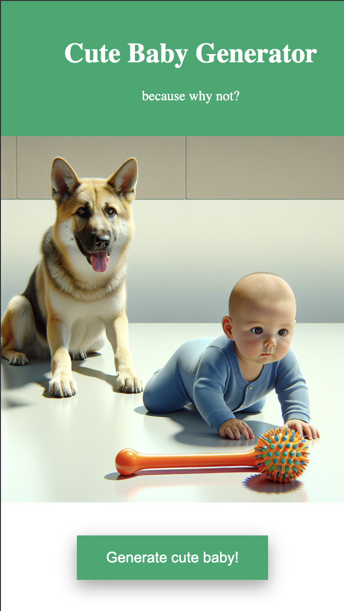

### Cute Baby Generator

Using the power of Lambda and DALL-E to generate the cutest baby pictures!
Try it at [cutebabygenerator.com](https://cutebabygenerator.com/)

We're mixing and matching a few different lighting and style prompts and passing them to Dall E 3.
Sometimes it works well, sometimes the colors are off or facial features appear cartoonish. Very occasionally the  prompt gets blocked by Open AI for some weird reason.

This was a fun side project I did to practice using AWS CDK and learn about Dall E. It's unlikely to be maintained.

## Getting started

* Grab an OpenAI API key [here](https://platform.openai.com/api-keys)
* Add it to your env vars `export OPENAI_API_KEY=<YOUR KEY HERE>`
* `npm run build`
* `cdk synth`
* `cdk deploy`
* Hit your `${API_gateway_endpoint}/v1/get-cute-baby` and enjoy cute baby pictures!

